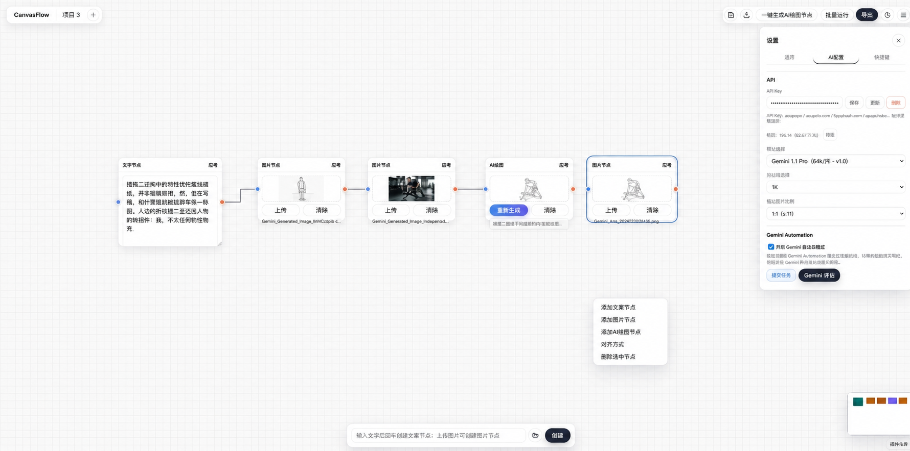

# CanvasFlow

**A local visual workflow tool for AI image generation**

CanvasFlow lets you connect text, reference images, and AI Image nodes to generate, organize, and save images without writing code.

[Download for Windows](https://github.com/wuxinliuyun-art/canvasflow/releases/latest) · [简体中文](README.md)



---

## How to Use

### 1. Download and Run

1. Open [GitHub Releases](https://github.com/wuxinliuyun-art/canvasflow/releases/latest).
2. Download and run `CanvasFlow-Setup.exe`.
3. Complete the per-user installation, then launch CanvasFlow from the desktop or Start menu.
4. Click **Open Main Canvas** in the Control Center.

> The installer is not commercially code-signed yet. Windows or antivirus software may request confirmation on first launch. Confirm that the file came from this project's official Release before allowing it.

### 2. Enter Your API Key

1. Click the gear button in the upper-right corner.
2. Open the **AI Image** settings.
3. Enter your API Key and save.

[Register for API access](https://apimart.ai/register?aff=W5d401)

> Your API Key is stored on this computer and is not included in automatic project backups.

The desktop app encrypts the API Key through Windows secure storage. If secure storage is unavailable, CanvasFlow warns you and keeps the key only for the current session.

### 3. Create Nodes

Right-click an empty area of the canvas to create Text, Image, AI Image, Angle Change, Group, and Output nodes, or insert saved custom text and images.

You can also drag images from your computer onto the canvas or paste copied images.

### 4. Connect and Generate

```text
Text Node  ─┐
            ├─→ AI Image Node ─→ Generated Image Node
Image Node ─┘
```

1. Describe the desired image in a Text node.
2. Upload a reference image to an Image node.
3. Connect the text and image to an AI Image node.
4. Choose the model, resolution, quality, and aspect ratio in that node.
5. Click **Generate**.

Connect only text for text-to-image generation. Add an Image node when you want the AI to use a reference image. Each completed result is automatically created as a regular Image node.

---

## Core Features

### Visual Node Canvas

- Organize image workflows with nodes and connections
- Move, select, copy, paste, delete, undo, and redo
- Grid snapping, canvas zoom, minimap, and grouping
- Click the keyboard icon in the lower-left corner to view shortcuts

### AI Image Generation

- Text-to-image, text with references, and multiple reference images
- Independent model, resolution, quality, and aspect-ratio settings per AI Image node
- Multiple tasks can run separately with progress shown on each node
- Results become regular Image nodes that can be connected and processed further

### Batch Generation

Multiple AI Image nodes can run at the same time. When using multiple references or grouped images, each result is displayed separately for easy selection and further processing.

### Custom Assets

- Save complete reusable text blocks and reference images
- Insert them quickly from the canvas context menu
- Share one local asset library across all projects
- Nodes created from assets are independent copies
- Editing or deleting an asset does not alter existing nodes
- Double-click custom images for a larger preview

On a fresh installation with an empty library, CanvasFlow provides two sample text assets: **Image to Line Art** and **Multi-view Reference**.

### Angle Change (Beta)

- Connect one reference image and regenerate it from another viewpoint
- Horizontal, pitch, and roll adjustments from `-180°` to `180°`
- Zoom and optional reversal of left/right wording in the automatic prompt
- Prompts are relative to the source image's current viewpoint
- Results are created and connected as regular Image nodes

> This feature uses AI regeneration rather than true 3D rotation. Complex objects, hidden areas, and large angle changes may produce inconsistent results.

### Images and Interface

- Upload, drag, paste, replace, and clear images
- Double-click to preview and save images as custom assets
- Simplified Chinese and English interfaces with remembered language choice
- Automatic project backup and GitHub Release update checks

### Screen Capture Generation

- Open a separate capture panel from the Control Center or canvas settings
- Keep the panel above other apps or collapse it into a narrow bar
- Manual mode freezes the display under the mouse and lets you select a local region
- Automatic mode reuses a saved display and region; display, resolution, or scaling changes require a new selection
- Reuse custom text assets and choose independent model, quality, ratio, and result count settings

---

## Saved Files and Common Questions

### Where are generated images saved?

Generated images appear on the canvas and are also saved automatically to:

```text
CanvasFlow folder\export\ai_generated\
```

For example, if the program is at `D:\CanvasFlow\CanvasFlow.exe`, generated images are saved in `D:\CanvasFlow\export\ai_generated\`.

To organize selected results, connect them to an Output node and use the **Export** button in the top toolbar.

### Where are projects saved?

Automatic project backups are stored in:

```text
CanvasFlow folder\download\自动备份\
```

The current project name is used as the filename. Later saves overwrite the same named file, so only the latest backup for each project name is retained. You can also use the top Save button to save a project JSON manually.

### Where are custom assets saved?

Custom text and images are stored in CanvasFlow's local data folder. They remain on this computer, are not uploaded to GitHub, and are not preloaded in the installer.

`data/custom-library.json` is generated locally after the application runs; it is not bundled with the download.

### The installer will not run

- Check whether Windows or antivirus software blocked it.
- Confirm that the file came from the official Release.

### Why is CanvasFlow still running after I close a window?

Closing the main canvas returns to the Control Center, and closing the Control Center minimizes it to the taskbar. Use **Exit Application** in the Control Center to wait for project saving and then close CanvasFlow completely.

### AI image generation failed

Check the API Key, network connection, account balance, and whether the selected model supports the chosen resolution and aspect ratio.

### Why can't CanvasFlow open the image folder directly?

Some antivirus tools block applications from launching Windows File Explorer. Copy the full path shown in Settings and paste it into the File Explorer address bar.

### How do updates work?

The Control Center checks GitHub Releases. When a new version is available, it downloads and verifies `CanvasFlow-Setup.exe`; installation starts only after the user clicks **Install and Restart**. CanvasFlow waits for the current project to save and never silently overwrites the running EXE.

---

## Download and Feedback

### Download the Latest Version

[Download CanvasFlow for Windows](https://github.com/wuxinliuyun-art/canvasflow/releases/latest)

Choose `CanvasFlow-Setup.exe`. The Source code downloads shown automatically by GitHub are for developers and are not needed by regular users.

### Report a Problem

Open a [GitHub Issue](https://github.com/wuxinliuyun-art/canvasflow/issues) and, when possible, include a screenshot, reproduction steps, CanvasFlow version, browser console error, and the name of any antivirus software in use.

### Data and Privacy

- CanvasFlow runs locally; projects and custom assets remain on this computer.
- API Keys are encrypted with Windows secure storage and excluded from projects and automatic backups.
- AI generation sends prompts and reference images to the API service configured by the user.
- Do not upload private, confidential, or unauthorized images.

---

## License

CanvasFlow is open source under the [MIT License](LICENSE).

You may use, modify, and distribute this project, including for commercial purposes, as long as the original copyright and license notice are retained. The software is provided “as is,” without warranty.

Third-party AI APIs, models, and generated content remain subject to their respective service terms.

---

[Latest Release](https://github.com/wuxinliuyun-art/canvasflow/releases/latest) · [Report an Issue](https://github.com/wuxinliuyun-art/canvasflow/issues) · [简体中文](README.md)

Developer setup and build instructions are available in [SOURCE_SETUP.md](SOURCE_SETUP.md) (Chinese).
