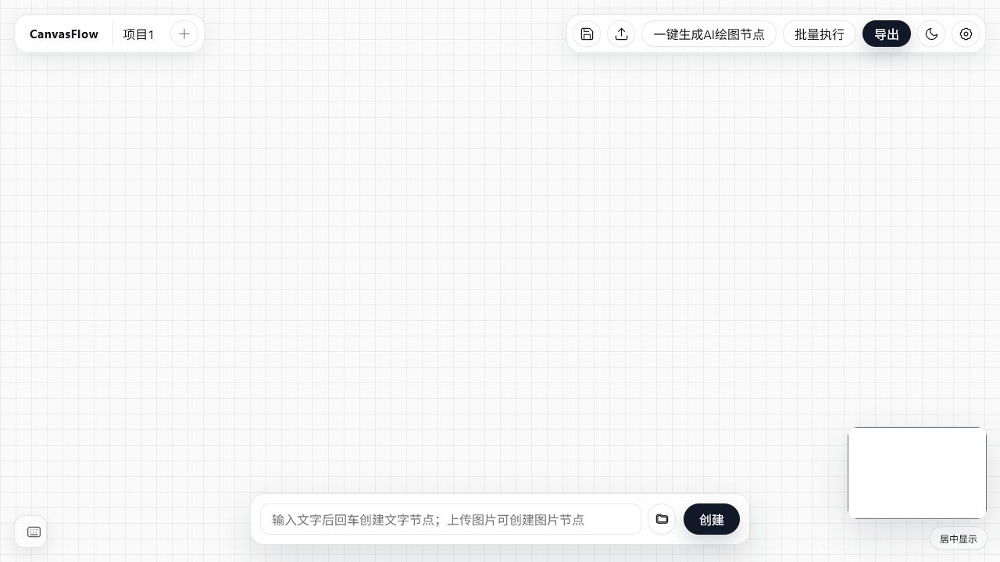
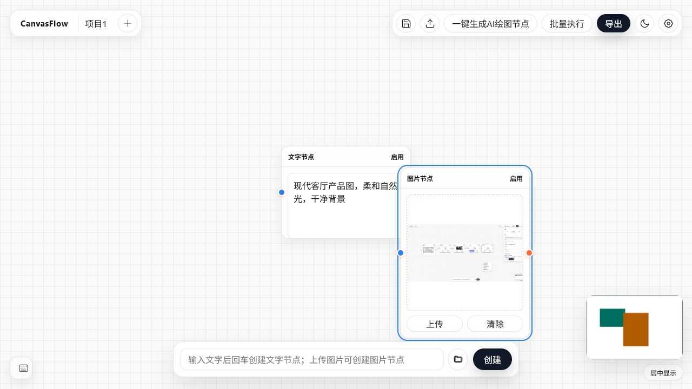
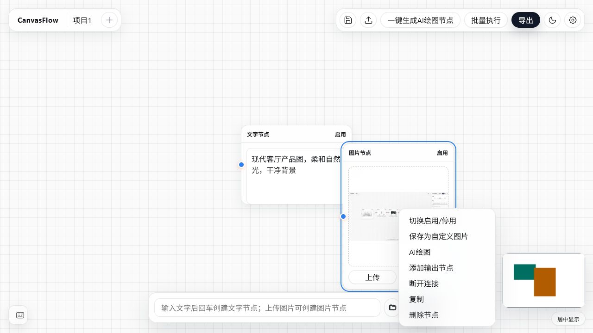
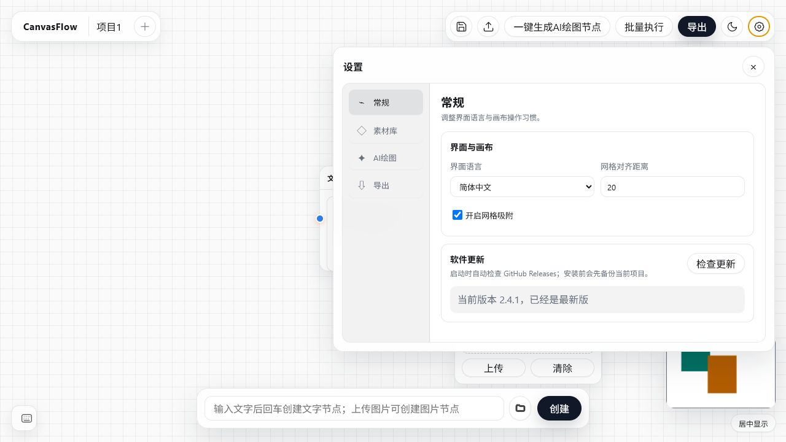
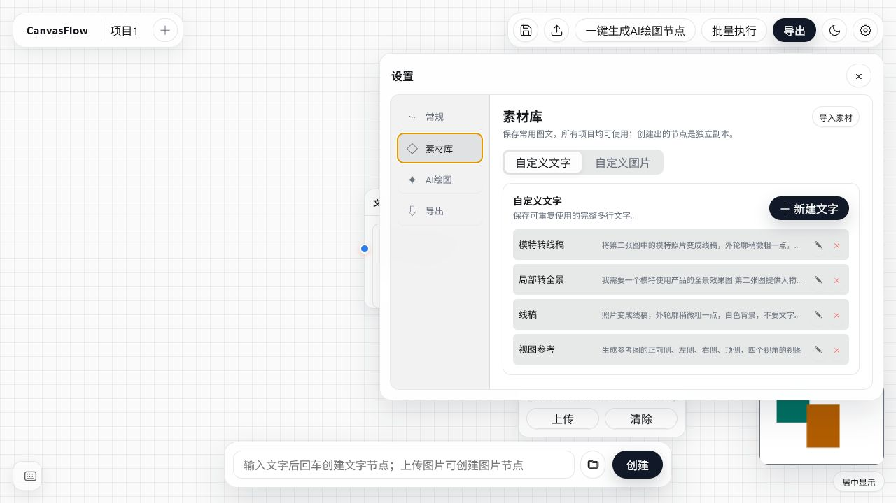
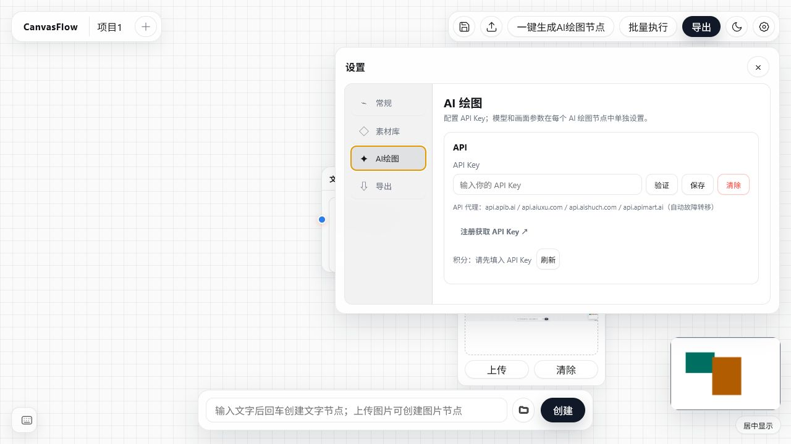
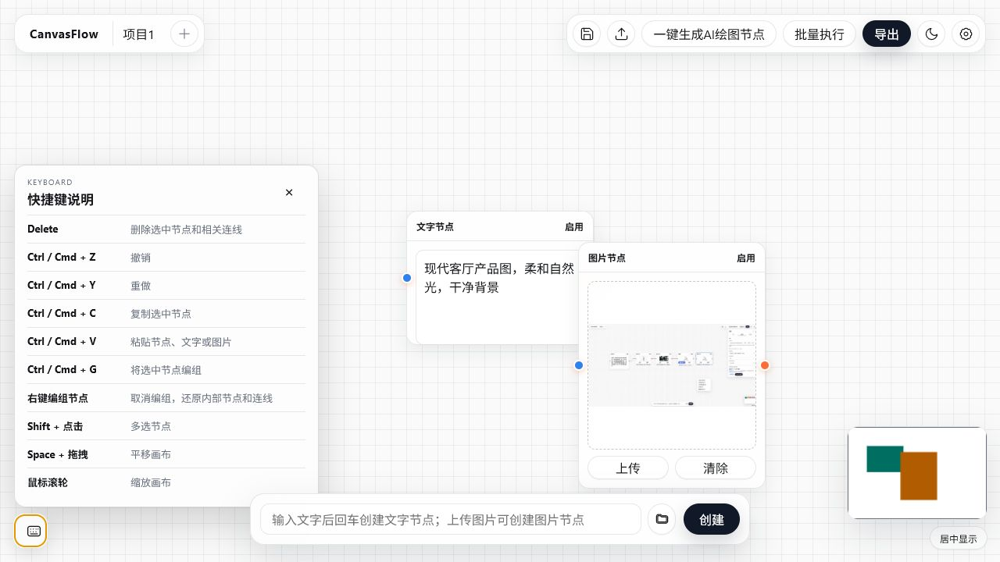

# CanvasFlow UI 评审与改版方案

## 评审范围

- 目标用户：第一次使用节点工具、没有编程经验的用户。
- 核心任务：创建文字和参考图，连接 AI 绘图节点，生成并管理结果。
- 覆盖界面：空画布、节点工作流、节点右键菜单、常规设置、素材库、AI 设置、快捷键面板。
- 本次只做界面与流程评审，没有修改产品代码。

## 总体判断

CanvasFlow 已经形成统一、轻量的视觉语言，画布空间充足，常用入口集中，设置层级也比传统工具简单。当前最主要的问题不是外观，而是新用户缺少明确的操作路径：空画布没有引导，新增节点会重叠，连接关系需要用户自己推断，右键菜单与顶部操作缺少层级。建议先解决任务路径，再统一图标、间距和状态表达。

## 评审步骤

### 1. 空画布 — 一般

优点：画布干净，顶部项目区与操作区分离，底部创建栏容易找到。

问题：首次进入时中央完全空白；“创建”没有说明会创建哪种节点；“一键生成 AI 绘图节点”“批量执行”“导出”在还没有内容时已经占据最高层级。新用户看得到很多功能，但不知道第一步。

建议：空画布中央增加可关闭的三步起始卡片：“1 添加提示词 → 2 添加参考图 → 3 创建 AI 绘图”；底部按钮根据输入状态显示“创建文字节点”或“上传并创建图片节点”；无可执行内容时弱化批量执行和导出。

### 2. 创建文字与图片节点 — 较弱

优点：节点标题、启用状态、输入输出端口和选中描边都能看见；图片采用完整显示，没有裁切内容。

问题：连续创建的节点出现在同一区域并互相遮挡；文字节点和图片节点只有标题区别，快速扫视时辨识度不足；蓝色和橙色端口没有文字提示，用户需要自行理解方向；图片节点偏高，和文字节点组合时视觉重量差异较大。

建议：新节点按创建顺序自动错开放置，且不得遮挡已有节点；为文字、图片、AI、结果节点增加统一的类型图标和轻微顶部色条；端口悬停显示“输入/输出”，首次连线时给一次短提示；提供“自动整理”作为选中多个节点后的显性操作。

### 3. 节点右键菜单 — 一般

优点：常用节点操作集中，文案基本直白。

问题：创建、转换、连接、复制和删除混在同一列表；“AI 绘图”更像节点名称，不像“用此图片创建 AI 绘图任务”；删除与普通操作没有明显区分；菜单会覆盖节点和底部创建区。

建议：分成“创建下一步 / 节点操作 / 管理”三组；将“AI 绘图”改为“用此节点创建 AI 绘图”；复制与删除置底，删除使用危险色但不要只靠颜色；菜单根据屏幕空间自动向上或向左展开。

### 4. 常规设置 — 良好

优点：左侧分类、右侧内容的结构清晰；标题、分组和控件关系明确；更新状态有反馈。

问题：导航图标使用字符符号，与顶部线性图标不是同一体系；选中导航使用黄色边框，而画布选中状态使用蓝色，状态语言不一致；说明文字和部分标签偏浅偏小；设置面板在 1280 像素宽度下占据较大面积，但内容很少。

建议：统一使用同一套 20–24px 线性图标；交互选中统一使用蓝色，黄色仅保留给提醒或更新；正文最小 13px、说明文字保证可读对比度；内容较少时收窄面板，素材库等长内容再使用宽布局。

### 5. 素材库 — 良好

优点：文字和图片分栏明确；列表紧凑；新增按钮突出；名称与内容摘要同时出现，符合复用素材的任务。

问题：长文本几乎只剩单行截断，无法比较相似素材；编辑和删除按钮尺寸很小，且只有符号；行本身是否可点击不明确；导入素材与新建素材的层级接近。

建议：列表行支持点击展开完整内容，再点击进入编辑；编辑、删除点击区域至少 32×32px并提供提示；“新建文字”保持主按钮，“导入素材”作为次要入口；为素材增加搜索，数量超过 8 条时再显示。

### 6. AI 绘图设置 — 一般

优点：明确告诉用户模型和画面参数在节点里设置；API Key、注册链接和积分入口集中。

问题：验证、保存、清除三个按钮权重相同；代理域名说明偏技术化，零基础用户不需要优先看到；“积分刷新”与 API Key 状态联系不够紧；注册链接虽然可点，但外观仍像普通文字。

建议：输入 Key 后只保留一个主操作“验证并保存”；清除放到更多菜单或危险操作区；代理说明折叠到“连接详情”；注册入口改成明确按钮“没有 API Key？免费注册”；验证成功后显示绿色状态和积分，失败时给出原因与解决办法。

### 7. 快捷键面板 — 良好

优点：入口固定在左下角，不影响右下角小地图；关闭方式明确；覆盖了主要节点操作。

问题：面板较高，遮挡较多画布；“KEYBOARD”与中文界面不一致；快捷键只是加粗文字，不像键帽，扫读效率一般；“右键编组节点”与其他键盘快捷键混在一起。

建议：快捷键使用键帽样式；分为“编辑、选择、画布”三个小组；将鼠标操作单独放在“鼠标操作”组；中文界面把顶部小标题改为“快捷操作”；允许面板内部滚动并减少默认高度。

## 最高优先级改版

1. **解决新手第一步**：空画布加入三步引导，底部“创建”根据内容说明具体结果。
2. **解决节点遮挡和关系不清**：新增节点自动错开；类型增加图标/色条；首次连线给提示。
3. **重排操作层级**：顶部只保留保存、执行、导出三个核心动作，其余收进次级入口；右键菜单按任务分组。
4. **统一状态语言**：蓝色表示选择与当前页面，黄色表示提醒，红色只表示危险操作；统一所有图标线宽与尺寸。
5. **提升可读性与可点击性**：说明文字提高对比度，图标按钮扩大点击区域，长素材支持展开阅读。

## 建议的新界面框架

- **左上：项目与页面**——CanvasFlow、当前项目、添加项目。
- **右上：工作流操作**——保存、运行、导出；设置、主题放入末端图标区。
- **画布中央：节点工作区**——空状态显示三步引导，有节点后自动隐藏。
- **左侧可选：紧凑添加栏**——文字、图片、AI、角度、输出；保留右键创建作为熟练用户捷径。
- **底部：快速输入栏**——输入文字时按钮显示“创建文字”；选中图片后显示“创建图片”；不再使用含义宽泛的“创建”。
- **状态反馈**——节点自身显示生成进度；全局只显示任务总数，不再让单一进度条代表多个任务。

## 无障碍风险与证据限制

- 截图可见的风险：说明文字对比度偏低；部分图标按钮点击区域偏小；端口和选中状态较依赖颜色；设置面板在结构上显示为侧栏而不是明确的对话框。
- DOM 中多数按钮有可读名称，设置页也有标题层级，这是好的基础。
- 本次截图无法确认完整键盘顺序、焦点样式、屏幕阅读器播报、缩放到 200% 后的重排，以及所有明暗主题对比度；这些需要单独做键盘和自动化无障碍测试。
